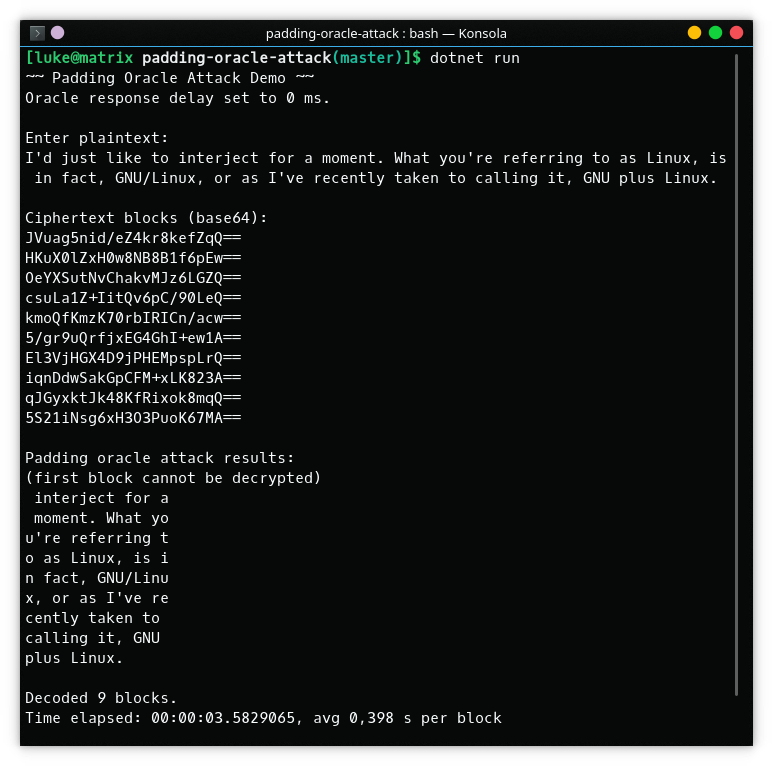
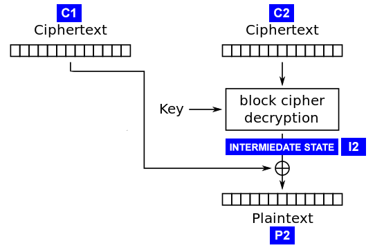

# AES-CBC Padding Oracle Attack demonstration

<small>_Translation of a study report made for Cryptology classes ([original in Polish](README.pl.md))._</small>

## Implementation overview

Implementation was made in .NET Core C#.

Oracle is implemented in [`RemoteServerMock`](RemoteServerMock.cs) class, which consists of two key methods: `Encrypt` – which encrypts the input string, `IsPaddingCorrect` – which returns information wheather there was an error during decryption regarding the wrong block padding. Implementation details of the encryption alhoritm (key, initialization vector), except of the padding scheme and alghoritm mode (CBC), aren't exposed outside the class.

Alghoritm for decription of the single block is implemented in [`PaddingOracleDecryptor`](PaddingOracleDecryptor.cs). `DecryptBlock` function takes the block intended to be decrypted and the previous one, in form of byte arrays, as arguments. The used method consists of obtaining successive intermediate state bytes (see I2 in the figure below) and using them to determine successive plain text bytes. Using the knowledge of the (lack of) correctness of the padding after decryption, provided by the Oracle, one can send to it an appropriately manipulated ciphertext, consisting of a specially prepared preceding block and the block one wants to decipher, get the information for which value of the ith byte in the manipulated preceding block the padding is correct. The manipulated block C’1 may initially have any values except the last one, which should be iteratively changed. When the Oracle does not return a padding error for the manipulated ciphertext, the value of the ith (in this case the first) byte from C'1 is known, which xored with the value of the ith intermediate state byte I2 gives the value of the ith byte of the plain text (e.g. in the case of padding length 1, the first byte at the end of the block in the PKCS7 scheme will be 1). So one can get the intermediate state value at the ith position, and by xoring it with the ith byte of the real previous ciphertext block, the ith byte of the plain text P2. Using the properties of the xor function, one should then replace the value of the ith byte of the manipulated block with such that in the resulting plaintext on the i-th position there will be a correct value for a padding of length 1 (in PKCS7 for a padding of length 2 it is 2 – the new value should therefore equal newC'1[i] = C'1[i] xor 1 xor 2). Then the previously described loop is repeated for byte i-1, the next "to the left", and subsequent ones until the beginning of the block.

(source: https://robertheaton.com/2013/07/29/padding-oracle-attack/)

The program provides support for two padding schemes – PKCS7 and ANSI X.923 (to change the implementation used, modify `paddingMode` in [Program.cs](Program.cs)). Helper functions which return padding values at specified positions and remove padding from blocks are in [`PaddingUtils`](PaddingUtils.cs).

[Program.cs](Program.cs) is the main file and is responsible for user interfactions.
Use `dotnet run` to the it, but first you need to install dependencies with `dotnet restore`. Learn about the (optional) command line options by executing `dotnet run -- --help`.

## Questions and answers

1. **What is the execution time of the attack for a 10-block ciphertext?**
Three subsequent measurements (s): 3.5829065; 3.4902909; 3.5674863. Average: 3.5468946 s. (2.5374309 blocks / s).
(First block weren't decoded.)
Processor: Intel® Core™ i5-4210U CPU @ 1.70GHz.

2. **When is it possible to also decrypt the first block?**
The first block can be decrypted if the initialization vector (IV) is available.
(I assumed in my implementation that it is not.)

3. **What implementation mistake should one make to make the attack possible?**
For an attack to be possible, it must be possible to send its own modified ciphertext, and the service must respond with an error in the event of an incorrect padding of the last block.

4. **Where has this attack been implemented?**
This attack was used against SSL and IPSec protocols, JavaServer Faces web frameworks, Ruby on Rails and ASP.NET, and other software ([Wikipedia](https://en.wikipedia.org/wiki/Padding_oracle_attack#Attacks_using_padding_oracles)).

5. **Does the attack work only for AES?**
No, the attack is based on the features of CBC (Cipher Block Chaining) in the block cipher, which creates a relationship between the blocks, such that the plaintext block is xored with the ciphertext of the preceding block (and the first block with the initialization vector).

6. **How many times at maximum the oracle has to be queried in order to decrypt a single block?**
In the most pessimistic case, it has to be queried 256⋅16 = 4096 times.
(256 - the number of possible values of a single byte, 16 - the number of bytes in a block, assuming a block size of 128 bits)

7. **Will the attack work if other padding schemes are used?**
Yes, as long as the padding scheme contains information about its length and format (what values should the individual bytes of padding take). In addition to PKCS7, it will also work with ANSI X.923. It will not work, however, in the case of padding with zeros (without length information) or the ISO 10126-2 scheme.
