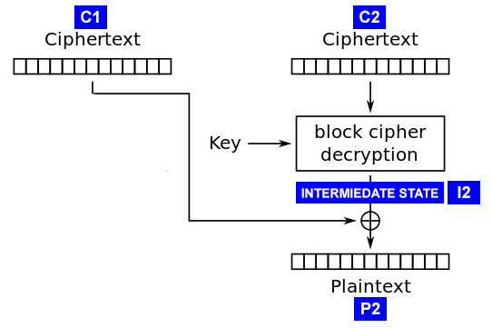

# Demonstracja ataku AES-CBC Padding Oracle

<small>_Sprawozdanie przygotowane na przedmiot Kryptologia._</small>

## Opis implementacji

Implementację wykonałem w środowisku .NET Core, w języku C#.

Wyrocznia została zaimplementowana w formie klasy [`RemoteServerMock`](RemoteServerMock.cs), zawierającej dwie kluczowe metody: `Encrypt` – szyfrującą przesłany ciąg znaków, `IsPaddingCorrect` – zwracającą informację, czy podczas deszyfrowania podanego szyfrogramu nastąpił błąd w związku z niepoprawnym dopełnieniem bloku. Szczegóły algorytmu szyfrowania (klucz, wektor inicjujący), poza wykorzystywanym schematem dopełniania i trybem działania algorytmu (CBC), nie są dostępne na zewnątrz klasy.

Algorytm deszyfrujący pojedynczy blok znajduje się w klasie [`PaddingOracleDecryptor`](PaddingOracleDecryptor.cs). Funkcja `DecryptBlock` przyjmuje jako argumenty blok do deszyfrowania oraz poprzedni, w formie tablic bajtów. Metoda polega na uzyskaniu kolejnych bajtów stanu pośredniego (I2 na rysunku poniżej) i wykorzystania ich do wyznaczenia kolejnych bajtów tekstu jawnego. Korzystając z wiedzy o (braku) poprawności dopełnienia po odszyfrowaniu, dostarczanej przez Wyrocznię, można przesyłając do niej odpowiednio zmanipulowany szyfrogram, składający się ze specjalnie przygotowanego bloku poprzedzającego i bloku, który pragnie się odszyfrować, uzyskać informację, dla jakiej wartości i-tego bajtu w zmanipulowanym bloku poprzedzającym wypełnienie jest poprawne. Zmanipulowany poprzedni blok C’1 początkowo może mieć dowolne wartości, poza ostatnią, którą należy iteracyjnie zmieniać. W momencie, gdy dla zmanipulowanego szyfrogramu Wyrocznia nie zwróci błędu dopełnienia, znana jest wartość i-tego (w tym wypadku pierwszego) bajtu z C’1, która w operacji xor z wartością i-tego bajtu stanu pośredniego I2 daje znaną wartość bajtu w tekście jawnym (np. w przypadku dopełnienia o długości 1, pierwszy bajt od końca w schemacie PKCS7 będzie miał wartość 1). Można więc uzyskać wartość stanu pośredniego na i-tej pozycji, a xorując ją z i-tym bajtem rzeczywistego poprzedniego bloku szyfrogramu, i-ty bajt tekstu jawnego P2. Korzystając z właściwości funkcji xor, należy następnie zamienić wartość i-tego bajtu zmanipulowanego bloku na taką, aby w otrzymywanym tekście jawnym na i-tej pozycji znalazła się wartość odpowiednia dla dopełnienia o jeden dłuższego (w PKCS7 dla wypełnienia o długości 2 jest to 2 – nowa wartość powinna więc równać się noweC’1[i] = C’1[i] xor 1 xor 2). Następnie opisaną pętlę powtarza się dla bajtu i-1, kolejnego „na lewo”, i kolejnych aż do początku bloku.

(żródło: https://robertheaton.com/2013/07/29/padding-oracle-attack/)

W programie przewidziano wsparcie dla dwóch algorytmów dopełnień – PKCS7 i ANSI X.923 (w celu zmiany stosowanej implementacji należy zmodyfikować pole `paddingMode` w pliku [Program.cs](Program.cs)). Funkcje pomocnicze zwracające ich wartości na zadanych pozycjach i usuwające dopełnienie z bloków znajdują się w klasie [`PaddingUtils`](PaddingUtils.cs).

Główny plik programu to [Program.cs](Program.cs) – zawiera on obsługę interakcji z użytkownikiem.
Program należy uruchomić poleceniem `dotnet run`, wcześniej należy jednak pobrać zależności poleceniem „dotnet restore”. O dostępnych (opcjonalnych) argumentach wywołania programu można dowiedzieć się, wpisując `dotnet run -- --help`.

## Odpowiedzi na pytania

1. **Jaki jest czas wykonania wykonania ataku dla szyfrogramu o wielkości 10 bloków?**
Kolejne trzy wyniki (s): 3,5829065; 3,4902909; 3,5674863. Średnia: 3,5468946 s. (2.5374309 bloków / s).
(Pierwszy blok nie był deszyfrowany.)
Procesor: Intel® Core™ i5-4210U CPU @ 1.70GHz.

2. **Kiedy możliwy jest odczyt również pierwszego bloku?**
Odczyt pierwszego bloku jest możliwy, jeśli jest dostępny wektor inicjujący (IV).
(W mojej implementacji założyłem, że nie jest.)

3. **Jaki błąd przy implementacji należy popełnić, aby atak był możliwy?**
Aby atak był możliwy, musi istnieć możliwość przesłania własnego zmodyfikowanego szyfrogramu, a usługa odpowiadać błędem, w wypadku niepoprawnego dopełnienia (ang. padding) ostatniego bloku.

4. **W jakich środowiskach zaimplementowano ten atak?**
Tego ataku użyto wobec protokołów SSL i IPSec, frameworków webowych JavaServer Faces, Ruby on Rails i ASP.NET oraz innego oprogramowania ([Wikipedia](https://en.wikipedia.org/wiki/Padding_oracle_attack#Attacks_using_padding_oracles)).

5. **Czy atak działa tylko dla algorytmu AES?**
Nie, atak opiera się na wykorzystaniu właściwości trybu łączenia bloków CBC w szyfrze blokowym, polegającym na wzajemnej relacji między blokami, takiej że blok tekstu jawnego jest sumowany modulo 2 (xor) z szyfrogramem poprzedzającego go bloku (a pierwszy blok z wektorem inicjującym).

6. **Ile razy maksymalnie należy odpytać wyrocznię w celu odczytania jednego bloku?**
W najbardziej pesymistycznym przypadku należy odpytać ją 256⋅16 = 4096 razy.
(256 – liczba możliwych wartości jednego bajtu, 16 – liczba bajtów w bloku, zakładając rozmiar bloku 128 bitów)

7. **Czy w przypadku zastosowania innych schematów paddingu atak będzie działał?**
Tak, o ile schemat dopełniania zawiera w sobie informację o jego długości i formacie (jakie wartości powinny przyjmować poszczególne bajty wypełnienia). Oprócz PKCS7, zadziała on również w przypadku ANSI X.923. Nie zadziała natomiast w przypadku dopełniania zerami (bez informacji o długości) albo schematu ISO 10126-2.
